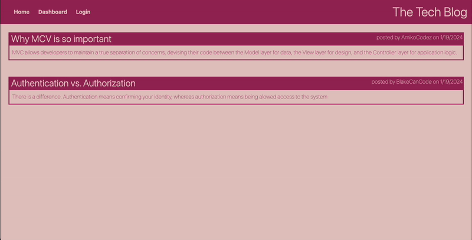

# Tech Blog

[](https://opensource.org/licenses/MIT)

## Description

Tech blog was created for developers who love to write about tech. Users can publish articles, blog posts, and thoughts and optinions. They can also comment on their fellow developers' posts.

This app was created using HTML5, CSS, front-end JavaScript, node.js with backend JavaScript, MySQL databate, and sequelize.

Link to deployed app: https://tech-blog-22-f16d8cb3f9c6.herokuapp.com/

## Table of Contents

- [Installation](#installation)
- [Usage](#usage)
- [Credits](#credits)
- [License](#license)
- [How-to-contribute](#how-to-contribute)

## Installation

if you would like to run this app on your own code space.
Make sure to have node installed.

Install the npm packages by running the following command

```bash
npm i
```

## Usage

User can see all posts the database by navigating on the homepage. See below for a demonstration

User can add their own post by hitting the 'add a new post' button under their dashboard. If the user is not logged in, they will be prompt to do so. The user is able to create an account and stay logged in for the duration of the session.
The user is able to edit and delete their posts by clicking on the post and hitting 'update post' or 'delete post', respectively.



if you are running this app on your own code space:

To create database:

```bash
$ mysql -u root -p
```

Then enter MySQL credentials and then run the schema file as shown below

```bash
mysql> SOURCE schema.sql
```

Create a .env file with the variables shown in the example file (.env.EXAMPLE). Make sure the new .env file is in your .gitignore file, since it will contain your MySQL password

Before starting the server, the database needs to be seeded by:

```bash
$ node seeds/seed.js
```

Start the server by:

```bash
$ npm start
```

or you can run the server on developer mode by:

```javascript
$ npm run dev
```

## Credits

N/A

## License

This application is covered under [MIT](https://choosealicense.com/licenses/mit/) license

## How to Contribute
If you have any questions, comments, or concerns please feel free to reach me at beatz.bravo@gmail.com. If you would like to contribute to my project, you can find my repo on [github.com/Beabravo](https://www.github.com/Beabravo)
